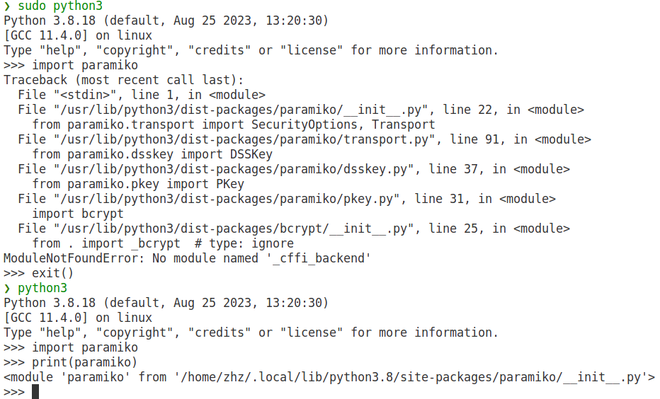
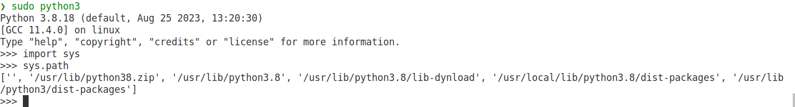
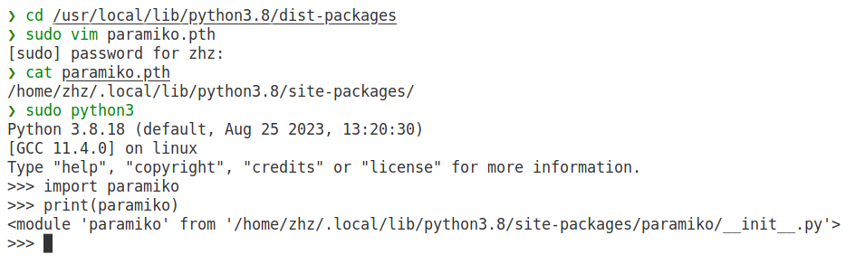

# 基于 SSH 的蜜罐

## 1. 实现思路


## 2. 实现步骤


## 3. 实现效果


## 4. 问题解决

- 基于ssh的蜜罐的实现基于linux操作系统，已经在ubuntu中完成测试，如果是其他操作系统比如macOS，那么在跳出终端界面后可能会有意想不到的效果，可能是因为macOS和linux在字符编码上有一定的差异。
- 代码的python版本为3.8.18，macOS可以使用[pyenv](https://zhuanlan.zhihu.com/p/532840161#:~:text=%E5%9C%A8Mac%E4%B8%8A%E8%BF%9B%E8%A1%8CPython%E5%A4%9A%E7%89%88%E6%9C%AC%E5%88%87%E6%8D%A2%201%201%E3%80%81%E5%AE%89%E8%A3%85Homebrew%202,2%E3%80%81%E9%80%9A%E8%BF%87brew%E5%AE%89%E8%A3%85pyenv%203%203%E3%80%81%E4%BD%BF%E7%94%A8pyenv%E5%AE%89%E8%A3%85Python3%204%204%E3%80%81%E8%A7%A3%E5%86%B3Python%E7%94%A8pip%E5%91%BD%E4%BB%A4%E5%AE%89%E8%A3%85%E9%80%9F%E5%BA%A6%E6%85%A2%EF%BC%8C%E6%94%B9%E7%94%A8%E5%9B%BD%E5%86%85%E9%95%9C%E5%83%8F)来进行版本的切换，而linux中可以从[deadsnakes PPA](https://blog.csdn.net/qq_51116518/article/details/130184514)中下载指定版本的python并设置为默认的python版本（注意，这里可能会有一些网络的问题，可能需要使用一些[国内镜像](https://www.jianshu.com/p/3a030350d2cd)），之后使用这个版本的python[下载对应的pip](https://blog.csdn.net/bubudezhuren/article/details/130949037)，再运行`pip3 install -r requirements.txt`即可完成环境配置。
- 由于程序需要监听22号端口，需要提高权限来运行脚本，这时候可能会出现错误。因为`sudo python3`可能无法找到某些包的位置：
  - 如下图所示，可以看到`sudo python3`无法找到paramiko模块，但是`python3`是可以的。
  - 上图打印出了paramiko的位置，下图打印出了`sudo python3`的搜索路径，可以发现搜索路径中确实不包含paramiko。
  - 我们需要让`sudo python3`知道paramiko的路径，具体方法如下所示。
- 由于paramiko的库函数`add_server_key`只支持RSA算法，但是目前的ssh大都使用ED25519算法，所以不能通过读取`.ssh/id_ed25519`*的方法读取系统的私钥来确保和系统的私钥相同，由于现在的ssh会有服务器的指纹认证（即第一次连接到服务器时，客户端会在`.ssh/known_host`中记录服务器的指纹，服务器的指纹是对服务器私钥的SHA256的摘要）来减少中间人攻击或者窃听的发生，也就是说如果服务器的指纹与客户端中记录的第一次的服务器的指纹不相符合，那么就会有类似如下的报错。实验中，我们直接在`.ssh/know_host`中删除对应服务器指纹记录即可，这里可以直接使用`sudo ssh-keygen -R 127.0.0.1[IP]`来删除记录。
```
@@@@@@@@@@@@@@@@@@@@@@@@@@@@@@@@@@@@@@@@@@@@@@@@@@@@@@@@@@@
@    WARNING: REMOTE HOST IDENTIFICATION HAS CHANGED!     @
@@@@@@@@@@@@@@@@@@@@@@@@@@@@@@@@@@@@@@@@@@@@@@@@@@@@@@@@@@@
IT IS POSSIBLE THAT SOMEONE IS DOING SOMETHING NASTY!
Someone could be eavesdropping on you right now (man-in-the-middle attack)!
It is also possible that a host key has just been changed.
The fingerprint for the RSA key sent by the remote host is
SHA256:/UleaaxRf2e9iflVAPS6TnH3ktvUlVUX6pX0jwnMv5A.
Please contact your system administrator.
Add correct host key in /Users/zhz/.ssh/known_hosts to get rid of this message.
Offending ED25519 key in /Users/zhz/.ssh/known_hosts:8
Host key for 127.0.0.1 has changed and you have requested strict checking.
Host key verification failed.
```