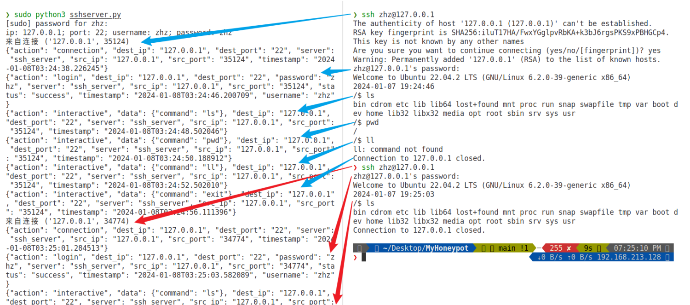
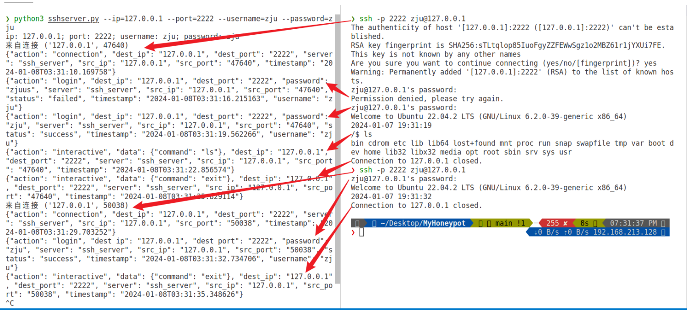
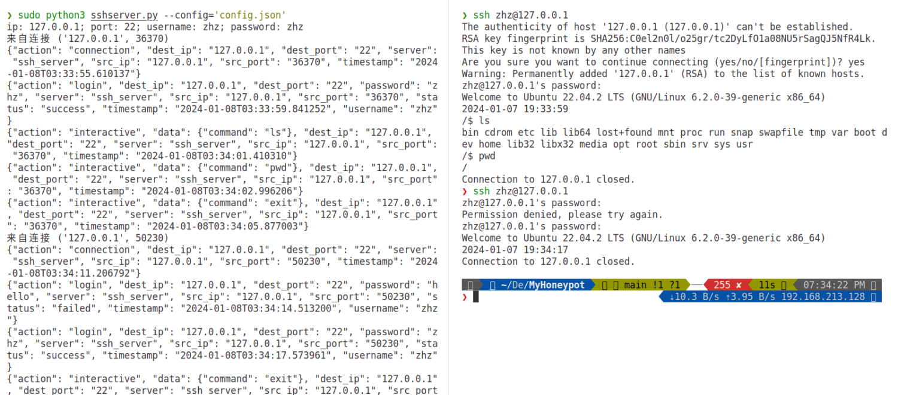
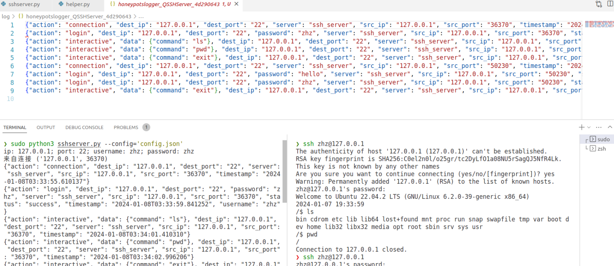

# 基于 SSH 的蜜罐

## 1. 实现思路

- **模拟真实SSH服务器**：蜜罐将模仿一个真实的SSH服务器，包括版本信息、响应行为等，以吸引攻击者。服务器版本将从预定义的列表中随机选择，以模拟不同类型的SSH服务。
- **用户认证模拟**：蜜罐将实现简单的用户认证逻辑，允许攻击者尝试使用不同的用户名和密码进行登录。这些尝试将被记录下来，以便于分析攻击者的行为模式。
- **交互式会话处理**：模拟一个交互式的shell环境，攻击者可以在其中输入命令。蜜罐将对常见的命令（如`ls`、`pwd`、`whoami`、`exit`）提供预设的响应。
- **日志记录**：所有连接尝试、认证信息、执行的命令及其参数等信息，不仅会打印在终端中，还会被详细记录，以便于后续的安全分析。

## 2. 实现步骤

1. **创建SSH服务器类（`QSSHServer`）**：

   - 类构造函数中初始化服务器配置，如IP地址、端口号、用户名和密码。
   - 定义用于日志记录的方法和工具。

   ```python
   def __init__(self, **kwargs):
       # 随机选择一个字符串作为 SSH 服务器的版本，以模拟真实的 SSH 服务器环境
       self.mocking_server = choice(['OpenSSH 7.5', 'OpenSSH 7.3', 'Serv-U SSH Server 15.1.1.108', 'OpenSSH 6.4']) 
       # 生成一个唯一标识符，用于日志记录或其他跟踪用途
       self.uuid = 'honeypotslogger' + '_' + __class__.__name__ + '_' + str(uuid4())[:8] 
   
       # 获取配置信息
       self.config = kwargs.get('config', '')
   
       if self.config:
           self.logs = setup_logger(__class__.__name__, self.uuid, self.config) # 为当前类创建一个日志记录器
           set_local_vars(self, self.config) # 为当前类设置本地变量
       else:
           self.logs = setup_logger(__class__.__name__, self.uuid, None) 
           
       # 设置类的属性
       # - 首先尝试从关键字参数 kwargs 中获取对应的值
       # - 如果关键字参数中没有提供，将检查类实例是否已经有这些属性。如果有，则使用已存在的值
       # - 如果以上两种方式都没有提供值，将使用默认值
       self.ip = kwargs.get('ip', None) or (hasattr(self, 'ip') and self.ip) or '127.0.0.1'
       self.port = (kwargs.get('port', None) and int(kwargs.get('port', None))) or (hasattr(self, 'port') and self.port) or 22
       self.username = kwargs.get('username', None) or (hasattr(self, 'username') and self.username) or 'zhz'
       self.password = kwargs.get('password', None) or (hasattr(self, 'password') and self.password) or 'zhz'
       self.ansi = rcompile(r'(?:\x1B[@-_]|[\x80-\x9F])[0-?]*[ -/]*[@-~]') # 匹配 ANSI 转义序列的正则表达式
   ```

2. **定义处理SSH请求的类（`SSHHandle`）**：

   - 继承`ServerInterface`并实现其方法，`check_auth_password`用于处理密码认证，`check_channel_request`用于处理通道请求。

   ```python
   # 处理认证请求
   # - 如果凭据与设置的用户名和密码匹配，则返回 AUTH_SUCCESSFUL，否则返回 AUTH_FAILED
   def check_auth_password(self, username, password):
       username = self.check_bytes(username)
       password = self.check_bytes(password)
       status = 'failed'
       if username == _q_s.username and password == _q_s.password:
           username = _q_s.username
           password = _q_s.password
           status = 'success'
       if status == 'success':
           _q_s.logs.info({'server': 'ssh_server', 'action': 'login', 'status': status, 'src_ip': self.ip, 'src_port': self.port, 'dest_ip': _q_s.ip, 'dest_port': _q_s.port, 'username': username, 'password': password})
           return AUTH_SUCCESSFUL
       _q_s.logs.info({'server': 'ssh_server', 'action': 'login', 'status': status, 'src_ip': self.ip, 'src_port': self.port, 'dest_ip': _q_s.ip, 'dest_port': _q_s.port, 'username': username, 'password': password})
       return AUTH_FAILED
   
   def check_channel_exec_request(self, channel, command):
       if "capture_commands" in _q_s.options:
           _q_s.logs.info({'server': 'ssh_server', 'action': 'command', 'src_ip': self.ip, 'src_port': self.port, 'dest_ip': _q_s.ip, 'dest_port': _q_s.port, "data": {"command": self.check_bytes(command)}})
       self.event.set()
       return True
   ```

3. **面向每一个连接设置和启动SSH传输层（`ConnectionHandle`）**：

   - 创建`Transport`对象并绑定到客户端socket，使用`add_server_key`方法添加服务器密钥，创建 `SSHHandle`实例并调用`start_server`方法启动SSH服务器。

   ```python
   def ConnectionHandle(client, priv):
       # 建立 SSH 传输层
       t = Transport(client)
       ip, port = client.getpeername()
       # 记录客户端连接信息
       _q_s.logs.info({'server': 'ssh_server', 'action': 'connection', 'src_ip': ip, 'src_port': port, 'dest_ip': _q_s.ip, 'dest_port': _q_s.port})
       # 设置模拟的 SSH 服务器版本
       t.local_version = 'SSH-2.0-' + _q_s.mocking_server
       t.set_gss_host(getfqdn(""))
       t.load_server_moduli()
       # 添加服务器的 RSA 密钥
       t.add_server_key(RSAKey(file_obj=StringIO(priv)))
       # 创建 SSHHandle 实例并启动 SSH 服务器
       sshhandle = SSHHandle(ip, port)
       t.start_server(server=sshhandle)
       # 等待客户端认证，超时设置为 30 秒
       conn = t.accept(30)
   ```

   - 这时服务器启动，等待客户端认证，超时设置为30s，如果认证成功，则启动交互式处理shell，这里实现得比较简单，就是简单地对一些命令进行预设的回复，更具有欺骗性的方法是使用一个真实的隔离的虚拟机。

   ```python
       # 处理交互式 shell
       if conn is not None:
           # 发送欢迎信息和命令提示符
           conn.send("Welcome to Ubuntu 22.04.2 LTS (GNU/Linux 6.2.0-39-generic x86_64)\r\n")
           current_time = time()
           local_time = localtime(current_time)
           formatted_time = strftime("%Y-%m-%d %H:%M:%S", local_time)
           conn.send(formatted_time)
           conn.send("\r\n")
           while True:
               conn.send("/$ ")
               line = ""
               while not line.endswith("\x0d") and not line.endswith("\x0a"): # and time() < current_time + 10:
                   conn.settimeout(10)
                   recv = conn.recv(1).decode()
                   conn.settimeout(None)
                   if _q_s.ansi.match(recv) is None and recv != "\x7f":
                       conn.send(recv)
                       line += recv
               line = line.rstrip()
               # 记录交互式命令
               _q_s.logs.info({'server': 'ssh_server', 'action': 'interactive', 'src_ip': ip, 'src_port': port, 'dest_ip': _q_s.ip, 'dest_port': _q_s.port, "data": {"command": line}})
               # 模拟命令执行结果
               if line == "ls":
                   conn.send("\r\nbin cdrom etc lib lib64 lost+found mnt proc run snap swapfile tmp var boot dev home lib32 libx32 media opt root sbin srv sys usr\r\n")
               elif line == "pwd":
                   conn.send("\r\n/\r\n")
               elif line == "whoami":
                   conn.send("\r\nroot\r\n")
               elif line == "exit":
                   break
               else:
                   conn.send("\r\n{}: command not found\r\n".format(line))
           # 关闭连接和传输 
           sshhandle.event.wait(2)
           conn.close()
           t.close()
   ```

4. **接受和处理客户端连接**：

   - 创建一个套接字对象，用于监听来自客户端的连接请求；

   ```python
   # 创建一个套接字对象 sock，用于监听来自客户端的连接请求
   sock = socket(AF_INET, SOCK_STREAM)
   sock.setsockopt(SOL_SOCKET, SO_REUSEADDR, 1) # 设置套接字的选项，以允许重新使用同一地址（IP 和端口）
   sock.bind((self.ip, self.port))
   sock.listen(1)
   ```

   - 生成或者读取 SSH 连接所需服务器的公钥和私钥；

   ```python
   pub, priv = self.generate_pub_pri_keys() # 生成 SSH 连接所需的公钥和私钥
   # with open('~/.ssh/id_rsa', 'r') as priv_file:
   #     priv = priv_file.read()
   # with open('~/.ssh/id_rsa.pub', 'r') as pub_file:
   #     pub = pub_file.read()
   ```

   - 无限循环等待连接，使程序持续运行并不断等待新的连接请求，使用`accept`方法阻塞等待一个新的客户端连接，返回一个新的套接字对象`client`和连接的客户端地址`addr`，然后在一个新的线程中启动`ConnectionHandle`函数，处理这个新的客户端连接。

   ```python
   while True:
       client, addr = sock.accept() 
       print("来自连接", addr)
       start_new_thread(ConnectionHandle, (client, priv,))
   ```

5. **记录日志信息**：

   - 在每个关键的交互点（如连接建立、用户认证、命令执行）记录详细信息，代码不再展示。

## 3. 实现效果
### 3.1 默认

默认的配置参数为`--ip=127.0.0.1 --port=22 --username=zhz --password=zhz`

```shell
sudo python3 sshhoneypot.py
```



### 3.2 命令行配置参数

```shell
python3 sshhoneypot.py --ip=127.0.0.1 --port=2222 --username=zju --password=zju
```



### 3.3 文件配置参数

```shell
sudo python3 sshhoneypot.py --config='config.json'
```
而`config.json`内容为如下所示：
- `"logs": "file, terminal"`：输出到终端和文件中；
- `"logs_location": "./log/"`：输出的文件的路径；
- `"honeypots":{}`：蜜罐的配置参数。
```json
{
  "logs": "file, terminal",
  "logs_location": "./log/",
  "honeypots": {
      "http": {
          "port": 22,
          "ip": "127.0.0.1",
          "username": "zhz",
          "password": "zhz",
          "log_file_name": "ssh.log",
          "max_bytes": 10000,
          "backup_count": 10
      }
  }
}
```



如下图所示，可以看到所有操作都在终端和文件中进行了记录。



## 4. 问题解决

- 基于ssh的蜜罐的实现基于linux操作系统，已经在ubuntu中完成测试，如果是其他操作系统比如macOS，那么在跳出终端界面后可能会有意想不到的效果，可能是因为macOS和linux在字符编码上有一定的差异。
- 代码的python版本为3.8.18，macOS可以使用[pyenv](https://zhuanlan.zhihu.com/p/532840161#:~:text=%E5%9C%A8Mac%E4%B8%8A%E8%BF%9B%E8%A1%8CPython%E5%A4%9A%E7%89%88%E6%9C%AC%E5%88%87%E6%8D%A2%201%201%E3%80%81%E5%AE%89%E8%A3%85Homebrew%202,2%E3%80%81%E9%80%9A%E8%BF%87brew%E5%AE%89%E8%A3%85pyenv%203%203%E3%80%81%E4%BD%BF%E7%94%A8pyenv%E5%AE%89%E8%A3%85Python3%204%204%E3%80%81%E8%A7%A3%E5%86%B3Python%E7%94%A8pip%E5%91%BD%E4%BB%A4%E5%AE%89%E8%A3%85%E9%80%9F%E5%BA%A6%E6%85%A2%EF%BC%8C%E6%94%B9%E7%94%A8%E5%9B%BD%E5%86%85%E9%95%9C%E5%83%8F)来进行版本的切换，而linux中可以从[deadsnakes PPA](https://blog.csdn.net/qq_51116518/article/details/130184514)中下载指定版本的python并设置为默认的python版本（注意，这里可能会有一些网络的问题，可能需要使用一些[国内镜像](https://www.jianshu.com/p/3a030350d2cd)），之后使用这个版本的python[下载对应的pip](https://blog.csdn.net/bubudezhuren/article/details/130949037)，再运行`pip3 install -r requirements.txt`即可完成环境配置。
- 由于程序需要监听22号端口，需要提高权限来运行脚本，这时候可能会出现错误。因为`sudo python3`可能无法找到某些包的位置：
  - 如下图所示，可以看到`sudo python3`无法找到paramiko模块，但是`python3`是可以的。
  - 上图打印出了paramiko的位置，下图打印出了`sudo python3`的搜索路径，可以发现搜索路径中确实不包含paramiko。
  - 我们需要让`sudo python3`知道paramiko的路径，具体方法如下所示。
- 由于paramiko的库函数`add_server_key`只支持RSA算法，但是目前的ssh大都使用ED25519算法，所以不能通过读取`.ssh/id_ed25519`*的方法读取系统的私钥来确保和系统的私钥相同，由于现在的ssh会有服务器的指纹认证（即第一次连接到服务器时，客户端会在`.ssh/known_host`中记录服务器的指纹，服务器的指纹是对服务器私钥的SHA256的摘要）来减少中间人攻击或者窃听的发生，也就是说如果服务器的指纹与客户端中记录的第一次的服务器的指纹不相符合，那么就会有类似如下的报错。实验中，我们直接在`.ssh/know_host`中删除对应服务器指纹记录即可，这里可以直接使用`sudo ssh-keygen -R 127.0.0.1[IP]`来删除记录。
  ```
  @@@@@@@@@@@@@@@@@@@@@@@@@@@@@@@@@@@@@@@@@@@@@@@@@@@@@@@@@@@
  @    WARNING: REMOTE HOST IDENTIFICATION HAS CHANGED!     @
  @@@@@@@@@@@@@@@@@@@@@@@@@@@@@@@@@@@@@@@@@@@@@@@@@@@@@@@@@@@
  IT IS POSSIBLE THAT SOMEONE IS DOING SOMETHING NASTY!
  Someone could be eavesdropping on you right now (man-in-the-middle attack)!
  It is also possible that a host key has just been changed.
  The fingerprint for the RSA key sent by the remote host is
  SHA256:/UleaaxRf2e9iflVAPS6TnH3ktvUlVUX6pX0jwnMv5A.
  Please contact your system administrator.
  Add correct host key in /Users/zhz/.ssh/known_hosts to get rid of this message.
  Offending ED25519 key in /Users/zhz/.ssh/known_hosts:8
  Host key for 127.0.0.1 has changed and you have requested strict checking.
  Host key verification failed.
  ```